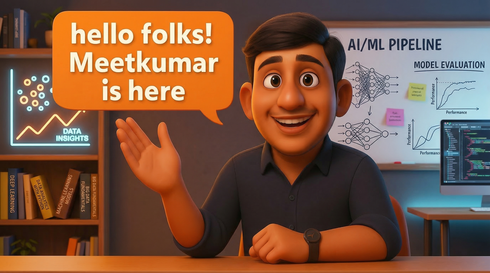

<h1 align="center">👋 Hallo Guten Tag</h1>

###

  

###

  
  

###

###

<h1 align="center"></h1>

###

<h2 align="left">👩‍🎓  About Me</h2>

###

<h4 align="left">I’m a self-driven and analytical Business Intelligence Analyst with experience in developing data-driven solutions for business optimization. I specialize in building intuitive dashboards, managing complex datasets, and crafting insightful reports to support strategic decision-making.</h4>

###

<h4 align="left">🎯 Business Intelligence Analyst | Data Analyst   📍 Berlin, Germany | 🇩🇪 🇬🇧   💼 Open to full-time roles in BI/Data Analysis</h4>

###

<h2 align="left">⚒️ Tech Stack</h2>

###

  
  
  
  
  
  
  
  
  
  
  
  
  
  
  
  
  
  
  
  
  

###

<h4 align="left">🧑‍💻 Programming Languages = Python, DAX, SQL 📊 Data Analytics & Libraries = Pandas, NumPy, Matplotlib, Scikit-learn, Seaborn 📈 Data Visualization Tools = Power BI, Tableau, Looker 🗄️ Databases = MySQL, MSSQL, MariaDB ☁️ Cloud Platforms = AWS S3, Microsoft Azure, Snowflake, Google Cloud Platform 🔧 DevOps & Tools = GitHub, GitLab, CI/CD 💻 Operating Systems = Windows, MacOS, Linux</h4>

###

<h2 align="left">📈 Services I Offer</h2>

###

<h4 align="left">📊 Data Analysis: Extract insights and trends from your business data.  📈 Business Intelligence Dashboards: Build actionable dashboards for decision-making.  🧠 Machine Learning: Develop models for predictive insights.  🖥️ Custom Software Solutions: Tailored tools for your specific business needs.</h4>

###

<h2 align="left">🚀 Projects</h2>

###

<h4 align="left">📊 Power BI Dashboards: Finance, Sales, and Marketing dashboards with real-time filters  🗄️ SQL Projects: Structured queries, data modeling, and stored procedures for banking systems  📈 Data Analysis Work: Exploratory data analysis and more</h4>

###

<h2 align="left">🎓 Continuing Education</h2>

###

<h4 align="left">I’m continuously expanding my skill set to stay ahead in the evolving data landscape. Currently, my focus areas include:  📊 Power BI – Advanced dashboard development and DAX optimization  🧩 SQL – Complex queries, stored procedures, and performance tuning  🔄 ETL – Designing efficient extract-transform-load pipelines  📈 Business Intelligence (BI) – Full-stack reporting, KPIs, and decision support systems</h4>

###

<h2 align="left">🌐Languages</h2>

###

<h4 align="left">🇩🇪 German – Professional 🇬🇧 English – Fluent</h4>

###

<h2 align="left">📬 Let's Connect</h2>

###

  
  
  

###
